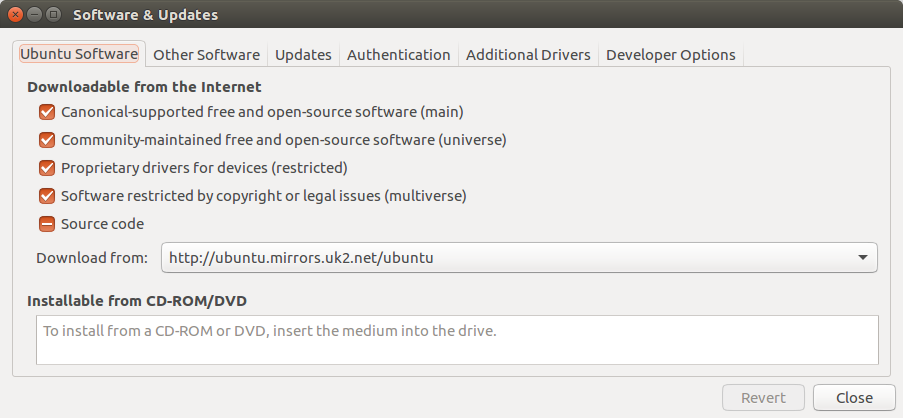
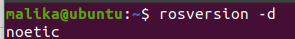
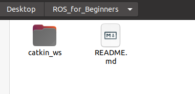

# **ROS for Beginner**

[](https://gitter.im/RNCManipal/ROS_for_beginners?utm_source=badge&utm_medium=badge&utm_campaign=pr-badge&utm_content=badge)

A repository made for people looking to learn ROS, made by students of Manipal Institute of Technology, Manipal.

# **Table Of Contents**
Getting started
1. [Installation Steps](#sec1)

    1.1 [Configure your Ubuntu repositories](#sec11) <br>
    1.2 [Setup your sources.list](#sec12) <br>
    1.3 [Set up your keys](#sec13)<br>
    1.4 [Installation](#sec14)<br>
    *    [ROS Melodic (for Ubuntu 18.04)](#sec141)  <br>
    *    [ROS Noetic (for Ubuntu 20.04)](#sec142) <br>
    
    1.5 [Environment setup](#sec15) <br>
    *    [ROS Melodic (for Ubuntu 18.04)](#sec151) <br>
    *    [ROS Noetic (for Ubuntu 20.04)](#sec152) <br>
    
    1.6 [Dependencies for building packages](#sec16) <br>
    *    [ROS Melodic (for Ubuntu 18.04)](#sec161) <br>

2. [Verify Installation](#sec2)

3. [Creating Workspace](#sec3) <br>
    3.1 [Setting up Git](#sec31) <br>
    3.2 [Workspace](#sec32) <br>
<br>
# **Getting Started**

Please install Ubuntu (18.04 or 20.04) on a system


<br>

# 1. Installation Steps <a id="sec1"></a>

## 1.1 Configure your Ubuntu repositories <a id="sec11"></a>
Configure your Ubuntu repositories to allow "restricted," "universe," and "multiverse." 

**The Four Main Repositories**

The "Ubuntu Software" tab displays a list of repositories or "Channels". The four main repositories are:

* Main - Canonical-supported free and open-source software.

* Universe - Community-maintained free and open-source software.

* Restricted - Proprietary drivers for devices.

* Multiverse - Software restricted by copyright or legal issues. 



<br>
<br> 

## 1.2 Setup your sources.list  <a id="sec12"> </a>

Setup your computer to accept software from packages.ros.org.   
```
sudo sh -c 'echo "deb http://packages.ros.org/ros/ubuntu $(lsb_release -sc) main" > /etc/apt/sources.list.d/ros-latest.list'
```
<br>

## 1.3 Set up your keys <a id="sec13"></a>

```
sudo apt-key adv --keyserver 'hkp://keyserver.ubuntu.com:80' --recv-key C1CF6E31E6BADE8868B172B4F42ED6FBAB17C654
```
<br>

## 1.4 Installation<a id="sec14"></a>

## *ROS Melodic (for Ubuntu 18.04)* <a id="sec141"></a>

First, make sure your Debian package index is up-to-date:

```
sudo apt update
```
**Choose any one method:**

> **Desktop-Full Install: (Recommended)** : ROS, rqt, rviz, robot-generic libraries, 2D/3D simulators and 2D/3D perception

>```sudo apt install ros-melodic-desktop-full```

<br>

>**Desktop Install**: ROS, rqt, rviz, and robot-generic libraries

>```sudo apt install ros-melodic-desktop```

<br>

>**ROS-Base**: (Bare Bones) ROS package, build, and communication libraries. No GUI tools.

>``` sudo apt install ros-melodic-ros-base```

<br>

>**Individual Package** : You can also install a specific ROS package (replace underscores with dashes of the package name):

>```sudo apt install ros-melodic-PACKAGE```

>e.g.

>```sudo apt install ros-melodic-slam-gmapping```

<br>

To find available packages, use:
```
apt search ros-melodic
```

## *ROS Noetic (for Ubuntu 20.04)*<a id="sec142"></a>

First, make sure your Debian package index is up-to-date:

```
sudo apt update
```
**Choose any one method:**

> **Desktop-Full Install: (Recommended)** : ROS, rqt, rviz, robot-generic libraries, 2D/3D simulators and 2D/3D perception

>```sudo apt install ros-noetic-desktop-full```

<br>

>**Desktop Install**: ROS, rqt, rviz, and robot-generic libraries

>```sudo apt install ros-noetic-desktop```

<br>

>**ROS-Base**: (Bare Bones) ROS package, build, and communication libraries. No GUI tools.

>``` sudo apt install ros-noetic-ros-base```

<br>

>**Individual Package** : You can also install a specific ROS package (replace underscores with dashes of the package name):

>```sudo apt install ros-noetic-PACKAGE```

>e.g.

>```sudo apt install ros-noetic-slam-gmapping```

<br>

To find available packages, use:
```
apt search ros-noetic
```
<br>

## 1.5 Environment setup<a id="sec15"></a>

## *ROS Melodic (for Ubuntu 18.04)*<a id="sec151"></a>

It's convenient if the ROS environment variables are automatically added to your bash session every time a new shell is launched: 

```
echo "source /opt/ros/melodic/setup.bash" >> ~/.bashrc
source ~/.bashrc
```

*If you have more than one ROS distribution installed, ~/.bashrc must only source the setup.bash for the version you are currently using.*

If you just want to change the environment of your current shell, instead of the above you can type: 

```
source /opt/ros/melodic/setup.bash
```

If you use zsh instead of bash you need to run the following commands to set up your shell: 

```
echo "source /opt/ros/melodic/setup.zsh" >> ~/.zshrc
source ~/.zshrc
```

## *ROS Noetic (for Ubuntu 20.04)*<a id="sec152"></a>


You must source this script in every **bash** terminal you use ROS in. 

```
source /opt/ros/noetic/setup.bash
```

It can be convenient to automatically source this script every time a new shell is launched. These commands will do that for you. 

**Bash**

```
echo "source /opt/ros/noetic/setup.bash" >> ~/.bashrc
source ~/.bashrc
```

**zsh**
```
echo "source /opt/ros/noetic/setup.zsh" >> ~/.zshrc
source ~/.zshrc
```


## 1.6 Dependencies for building packages<a id="sec16"></a>

## *ROS Melodic (for Ubuntu 18.04)*<a id="sec161"></a>

To install dependencies for building ROS packages, run: 

```
sudo apt install python-rosdep python-rosinstall python-rosinstall-generator python-wstool build-essential
```

### 1.6.1 Initialize rosdep

Before you can use many ROS tools, you will need to initialize `rosdep`. `rosdep` enables you to easily install system dependencies for source you want to compile and is required to run some core components in ROS. If you have not yet installed rosdep, do so as follows. 
```
sudo apt install python-rosdep
```
With the following, you can initialize `rosdep`. 
```
sudo rosdep init
rosdep update
```

# 2. Verify Installation<a id="sec2"> </a>

Verify the installation by running `rosversion -d` on a terminal


<br>
<br>

# 3. Creating the Workspace<a id="sec3"> </a>

If you have already installed ROS and created a workspace, please comment out the lines sourcing the existing workspace. 

## 3.1 Setting up Git<a id="sec31"> </a>

1. Clone the **ROS_for_Beginners** repository (preferably using SSH)
2. Create a branch containing your name. For example, if your name is `Lorem ipsum dolor`, then the name of your branch must be `lorem-d` (first_name-last_name_initial). Push the newly created branch.

## 3.2 Workspace<a id="sec32"> </a>
1. Go to the repository folder and checkout your branch. This will be the branch that you will be working on.
2. Create an empty folder with the name `catkin_ws` inside your repository. 
    - This folder shall be the *workspace* for all work pertaining to this repository
3. In the *workspace folder*, create a file called `.gitignore`.
    - ROS will create build files and developer files, among many more things. These should not be pushed to the remote repository (on GitHub). So we tell git to ignore them from the version control system.
    -   The remote repository must only contain the source code.
4. Create an `src` folder inside your workspace folder and run `catkin_init_workspace` in it (inside the `src` folder).
5. Go to the workspace folder and run `catkin_make` in it
    -   This will create build and devel directories. Add them to the .gitignore file (so that git doesn't track them)
    - Source this workspace, you may add this line to your `~/.bashrc` file
        - Only one workspace must be source at a time. The environment variable `$ROS_PACKAGE_PATH` will show the workspaces sourced (run `echo $ROS_PACKAGE_PATH`). Do not work on multiple workspaces at once.

> Repo folder: Folder of this repository on your local system.<br>
> Workspace folder: The catkin_ws workspace folder inside your repo folder.

<br>

 Repo Folder | Workspace Folder
------------ | -------------
 |


